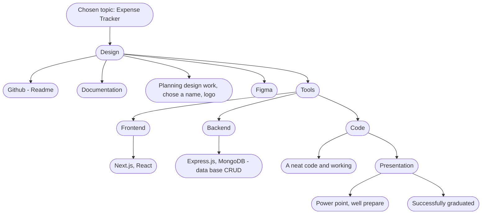

Frontend install:

npm init
1. `npx create-next-app@latest`
2.  When asked..
    - to provide a name for your mini project: **Yes**, *()*
    - Would you like to use TypeScript with this project ? **Yes**, **HIGHLY ENCOURAGED, not required*
    - Would you like to use ESLint with this project? **Yes**
    - Would you like to use Tailwind CSS with this project? **Optional*
    - Would you like to use `src/` directory with this project? **No**
    - Use App Router ? **Yes** **RECOMMENDED*
    - Would you like to customize the default import alias? **No**

3. `cd mini-project-2` (or whatever you named your project)
4. `npm install`
5. `npm run dev`

npm install antd
npm install swr
npm install recharts

Backend install:
npm init
npm install express
npm install dotenv
npm install nodemon
npm install mongoose --save
npm install axios
npm install cors --save
add in package.json "scripts": {"start": "nodemon server.js"}
change "main": "index.js", to "dbConnect.js"

Capstone project: 

Money Minder 
Income & Expenses Tracker

Figma: https://www.figma.com/file/Afc3nvQDXYD6QVxoZxmxJL/Capstone-Project?type=design&node-id=0-1&mode=design&t=DUZi0pLaPpwF9HTG-0

An application that allows users to track their expenses, and categorize them. 
Users can add transactions on the Categories pages and visualize on the Dashboard page.

1 - Home Page: Giving a welcome to the app introducing the logo and name and what is the functionality of the application

2 - Login Page: Users can login and logout. After login it goes automatically to Categories page.

3 - Categories Page: A friendly interface with categories where the user can enter their expenses. Users can enter expense amounts into specific categories and add notes.

4 - Dashboard Page: Users can visualize the information in a table and also in a round graph

5 - Mobile Responsiveness: The app is responsive and accessible on multiple devices including desktops, tablets, and mobile phones. This allows users to track their expenses anywhere.

