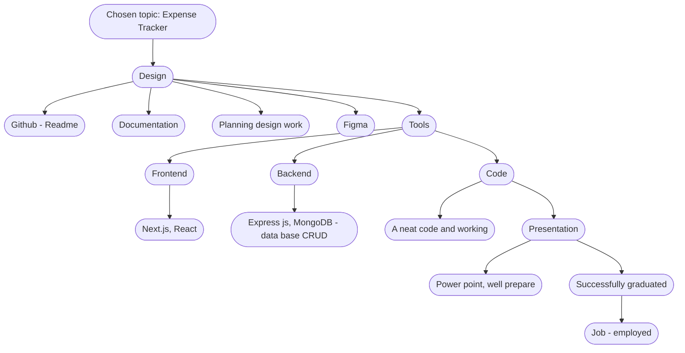

Capstone project: Expense Tracker

An application that allows users to track their expenses, and categorize them. 
Users can add, edit, and delete expenses, and set budgets.

1 - Login: Users can sign up, log in, and manage their profile information.

2 - Expense Input: A friendly interface with categories where users can input their expenses. Users can enter details such as expense amount (eg food, transport, rent, essential bills like electricity, water, and gas), additional notes, and new categories.

3 - Expense Management: Enable users to manage their expenses by allowing them to add, edit, and delete.

4 - Mobile Responsiveness: The app is responsive and accessible on multiple devices including desktops, tablets, and mobile phones. This allows users to track their expenses anywhere.

5 - 

