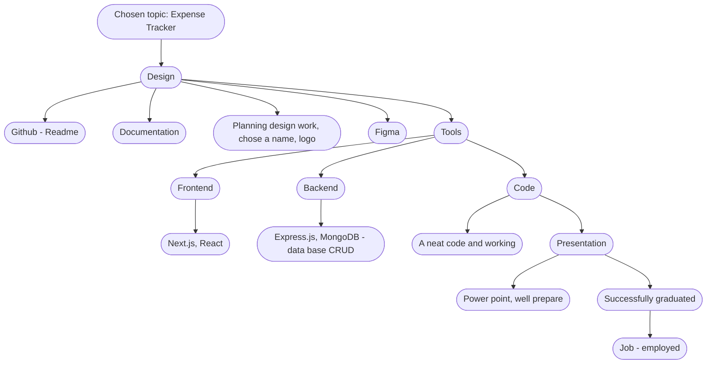

Frontend install:

npm init
1. `npx create-next-app@latest`
2.  When asked..
    - to provide a name for your mini project: **Yes**, *()*
    - Would you like to use TypeScript with this project ? **Yes**, **HIGHLY ENCOURAGED, not required*
    - Would you like to use ESLint with this project? **Yes**
    - Would you like to use Tailwind CSS with this project? **Optional*
    - Would you like to use `src/` directory with this project? **No**
    - Use App Router ? **Yes** **RECOMMENDED*
    - Would you like to customize the default import alias? **No**

3. `cd mini-project-2` (or whatever you named your project)
4. `npm install`
5. `npm run dev`

npm install antd
do I need SWR?Is it just for APIS?npm install swr

Backend install:
npm init
npm install express
npm install dotenv
npm install nodemon
npm install mongoose --save
npm install axios
npm install cors --save
add in package.json "scripts": {"start": "nodemon"}
change "main": "index.js", to "dbConnect.js"

Capstone project: Income and Expenses Tracker

Money Minder

An application that allows users to track their expenses, and categorize them. 
Users can add, edit, and delete expenses, and set budgets.

Maybe consider https://www.akahu.nz/

1 - Login: Users can sign up, log in, and manage their profile information. (if I have enough time)

2 - Expense Input: A friendly interface with categories where users can input their expenses. Users can enter details such as expense amount (eg food, transport, rent, essential bills like electricity, water, and gas), additional notes, and new categories.

3 - Expense Management: Enable users to manage their expenses by allowing them to add, edit, and delete.

4 - Mobile Responsiveness: The app is responsive and accessible on multiple devices including desktops, tablets, and mobile phones. This allows users to track their expenses anywhere.

5 - Page Learning Resources: Articles and videos with tips on how to have effective financial responsibility and how to save and how to make a better investment of your money.

